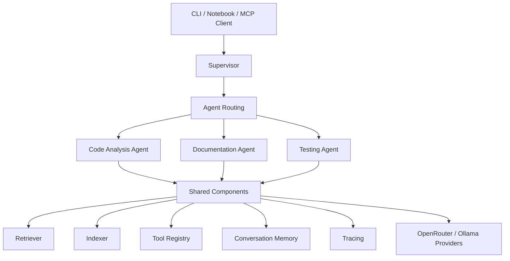
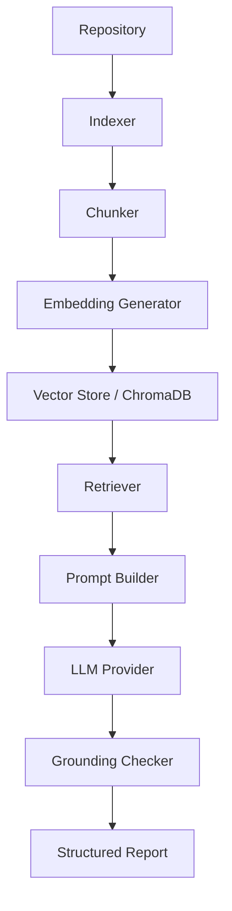
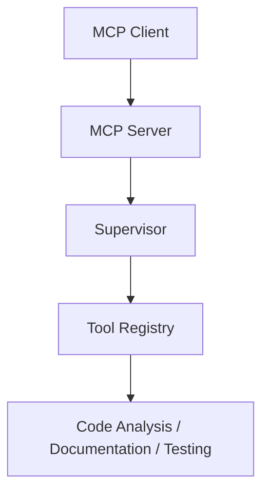

# AI Software Engineering Assistant

[](https://www.python.org/)
[](https://docs.pytest.org/)
[](https://www.trychroma.com/)
[](#mcp-architecture)

A multi-agent AI assistant that helps developers understand, debug, document, and test Python repositories.

It ingests a local path or public GitHub URL, indexes the codebase with RAG, and routes work through a Supervisor to specialized agents — Code Analysis, Documentation, and Testing — while grounding LLM claims against real source text.

> **Problem it solves:** inherited or unfamiliar codebases are slow to audit by hand. This project turns repository analysis, documentation drafts, and pytest generation into a single, structured multi-agent pipeline with retrieval, tracing, and memory.

---

## Table of Contents

- [Features](#features)
- [Architecture](#architecture)
- [Multi-Agent Architecture](#multi-agent-architecture)
- [RAG Pipeline](#rag-pipeline)
- [MCP Architecture](#mcp-architecture)
- [Conversation Memory](#conversation-memory)
- [Tracing](#tracing)
- [Supported Models](#supported-models)
- [GitHub Integration](#github-integration)
- [Installation](#installation)
- [Environment Variables](#environment-variables)
- [CLI Usage](#cli-usage)
- [Screenshots](#screenshots)
- [Example Outputs](#example-outputs)
- [Testing](#testing)
- [Project Structure](#project-structure)
- [Current Limitations](#current-limitations)
- [Future Work](#future-work)
- [License](#license)

---

## Features

| Area | Capability |
|---|---|
| Analysis | Repository analysis with static (`pyflakes` + `ast`) and optional LLM passes |
| Documentation | Documentation generation grounded in retrieved code context |
| Testing | Pytest test generation with local execution of generated tests |
| Repositories | Local paths and GitHub HTTPS URLs |
| RAG | Chunking, embeddings, ChromaDB vector store, semantic retrieval |
| Indexing | Incremental indexing via content-hash manifest |
| Quality | Grounding checker rejects hallucinated evidence before it reaches the user |
| Models | OpenRouter with automatic model fallback; optional local Ollama |
| Retrieval | Optional cross-encoder reranking (disabled by default) |
| Memory | Short-term conversation memory with automatic summarization and disk persistence |
| Observability | End-to-end tracing with ordered events and JSON export |
| Tools | Shared `ToolRegistry` for filesystem and GitHub tools |
| MCP | Local MCP server exposing Supervisor agent pipelines (`analysis.run`, `documentation.run`, `testing.run`, `goal.run`) |
| Interfaces | Interactive CLI menu, non-interactive `--agent` mode, and Jupyter demo notebook |

---

## Architecture



The Supervisor owns shared services and dispatches each request to the correct agent. Agents do not invent a second routing layer — CLI and MCP both call the same Supervisor pipelines.

Editable architecture references also live under [`docs/architecture.excalidraw`](docs/architecture.excalidraw) and [`docs/architecture.png`](docs/architecture.png).

---

## Multi-Agent Architecture

### Supervisor

Top-level orchestrator. It prepares the repository, wires providers and tools, routes `handle_task(...)` / `handle_goal(...)` to agents, aggregates responses, and records lifecycle traces.

### Code Analysis Agent

Runs the bug-finding pipeline:

1. Optional index update when a model is available
2. Deterministic static analysis
3. Grounding of static findings
4. Retrieval + LLM analysis (when a provider is available)
5. Grounding of LLM findings
6. Merge, deduplicate, and return a `CodeAnalysisReport`

Without a configured LLM, analysis still completes using static findings only.

### Documentation Agent

Retrieves relevant context for a target (for example `README` or a module) and asks the model to produce a structured `DocumentationResult` (summary, parameters, returns, example usage).

### Testing Agent

Generates pytest tests for a target module/function, writes them to a temporary location, executes them with `pytest`, and returns a `TestingResult` that includes generated sources plus an execution summary.

### ToolRegistry

Canonical registry of callable tools. Filesystem helpers, GitHub helpers, and MCP agent tools are registered here so agents and the MCP server resolve capabilities through one interface.

---

## RAG Pipeline



**How it works**

1. **Indexer** walks the repository (respecting size/file caps and ignore directories) and updates the index incrementally.
2. **Chunker** produces AST-aware chunks for Python and section chunks for Markdown/text.
3. **Embeddings** are generated with `sentence-transformers` (`all-mpnet-base-v2` by default).
4. **Vector store** persists chunks in ChromaDB.
5. **Retriever** returns the top-k semantically similar chunks (optional cross-encoder rerank).
6. **Prompt builder** packs retrieved context into grounded prompts for the agents.
7. **LLM** proposes findings or documentation/tests.
8. **Grounding checker** verifies quoted evidence against the real source before results are accepted.

---

## MCP Architecture

The MCP layer is another frontend for the existing Supervisor — it does not reimplement agent logic or routing.



**Exposed agent tools**

| Tool | Supervisor call | Result |
|---|---|---|
| `analysis.run` | `handle_task("analysis: …")` | `CodeAnalysisReport` |
| `documentation.run` | `handle_task("documentation …")` | `DocumentationResult` |
| `testing.run` | `handle_task("testing …")` | `TestingResult` |
| `goal.run` | `handle_goal(...)` | Ordered `AgentResponse` list |

Transport is **local / in-process** for the current foundation. The server owns a Supervisor instance, mirrors its `ToolRegistry`, and records MCP request/response/tool traces.

---

## Conversation Memory

| Component | Role |
|---|---|
| `ConversationMemory` | Short-term turn history used during a CLI/session run |
| `MemoryStore` | Persistent on-disk store for conversation snapshots |
| Summarization | When history exceeds the configured message cap, older turns are condensed via the LLM into a system summary |
| Persistence | After each update (and after successful summarization), state is saved through `MemoryStore` |

If the provider is unavailable during summarization, history is left unchanged so no turns are lost.

---

## Tracing

`Tracer` records ordered lifecycle events for a run.

**What gets traced**

- CLI start / agent selection
- Supervisor routing and agent runs
- Ingestion / retrieval / model / tool calls
- Memory summarization
- MCP request, tool invoked, and MCP response (with duration and success)

**Event model**

- Typed categories (`lifecycle`, `agent_run`, `retrieval`, `model_call`, `tool_call`, `memory`, `error`, …)
- Monotonic sequence numbers for deterministic ordering
- Optional duration, success flag, component name, and error text

**Export**

```python
supervisor.tracer.export("trace.json")
```

Writes deterministic JSON with `run_id`, ordered `events`, and an aggregate `summary`.

---

## Supported Models

### OpenRouter

Primary remote provider. Used for analysis and as the general LLM backend when `OPENROUTER_API_KEY` is configured.

Default primary model: `google/gemma-3-27b-it`.

### Gemma

Reached through OpenRouter (`google/gemma-3-27b-it`). Default primary model for code analysis and grounded bug finding.

### Llama

OpenRouter fallback candidate: `meta-llama/llama-3.1-8b-instruct`.

Also available locally via Ollama as `llama3` (default Ollama model).

### Nemotron

OpenRouter fallback candidate: `nvidia/nemotron-nano-9b-v2`.

### Ollama

Local provider for models served at `OLLAMA_BASE_URL` (default `http://localhost:11434`). Default model: `llama3`. Used when a local documentation/runtime path is preferred.

### Automatic model fallback

`OpenRouterProvider` retries across a fixed fallback chain when the API returns selected recoverable statuses (for example payment/model-unavailable cases). Authentication and malformed-request failures do **not** walk the chain — they fail fast.

Fallback order:

1. Primary model (default Gemma 3 27B IT)
2. Llama 3.1 8B Instruct
3. Nemotron Nano 9B

---

## GitHub Integration

| Capability | Behavior |
|---|---|
| Supported URLs | HTTPS GitHub repository URLs |
| Local paths | Existing directories on disk |
| Clone | Validated, then cloned with GitPython (CLI `git` fallback) |
| Temporary workspace | Remote repos are cloned into a temp directory for the run |
| Cleanup | Temporary clones are removed when the CLI/MCP session finishes |
| REST reads | `get_file_contents`, `list_issues`, `list_pull_requests` |
| REST writes | `create_branch`, `commit_file`, `create_pull_request` (require `GITHUB_TOKEN`) |

Public clone/validate works without a token. Authenticated GitHub write operations require `GITHUB_TOKEN`.

---

## Installation

All commands assume you are inside the `Project/` directory of this repository.

### 1. Clone the repository

```bash
git clone https://github.com/Huzaifa859/AgenticAI-Intern-Huzaifa-Saboor-.git
cd AgenticAI-Intern-Huzaifa-Saboor-/Project
```

### 2. Create a virtual environment

```bash
python -m venv .venv

# Windows
.venv\Scripts\activate

# macOS / Linux
source .venv/bin/activate
```

### 3. Install requirements

```bash
pip install -r codebase_assistant/requirements.txt
```

> First RAG indexing download may pull the embedding model (~400 MB).

### 4. Create `.env`

Create `Project/.env`:

```bash
OPENROUTER_API_KEY=your_key_here
# Optional:
# GITHUB_TOKEN=ghp_...
# OLLAMA_BASE_URL=http://localhost:11434
# RERANK_ENABLED=false
```

### 5. Run

```bash
# Interactive menu
python app/main.py .

# Non-interactive analysis
python app/main.py . --agent analysis --question "Find security bugs"
```

---

## Environment Variables

Variables below are loaded by `Config.load()` (from `Project/.env` and the process environment).

| Variable | Required | Default | Description |
|---|---|---|---|
| `OPENROUTER_API_KEY` | For LLM features | unset | OpenRouter API key |
| `OPENROUTER_BASE_URL` | No | `https://openrouter.ai/api/v1` | OpenRouter API base URL |
| `OLLAMA_BASE_URL` | No | `http://localhost:11434` | Local Ollama service URL |
| `GITHUB_TOKEN` | For authenticated GitHub API writes | unset | GitHub personal access token |
| `WORKSPACE_ROOT` | No | `.` | Default workspace root |
| `CHROMA_PERSIST_DIR` | No | `./.codebase_assistant/chroma` | ChromaDB persistence directory |
| `MEMORY_STORE_PATH` | No | `./.codebase_assistant/memory_store` | Persistent conversation memory path |
| `RETRIEVAL_TOP_K` | No | `8` | Chunks returned per retrieval query |
| `RERANK_ENABLED` | No | `false` | Enable cross-encoder reranking |
| `RERANK_MODEL_NAME` | No | `cross-encoder/ms-marco-MiniLM-L-6-v2` | Reranker model |
| `RERANK_CANDIDATES` | No | `24` | Candidate pool size before rerank |
| `LOG_LEVEL` | No | `INFO` | Logging threshold |

Model identifiers (`openrouter_model`, `claude_model`, `ollama_model`) are Config defaults (`google/gemma-3-27b-it` and `llama3`) unless changed in code/configuration objects.

---

## CLI Usage

### Interactive menu

```bash
python app/main.py .
```

Omitting `--agent` prepares the repository once and opens a menu for Code Analysis, Documentation, or Testing.

### Analyze

```bash
python app/main.py . --agent analysis --question "Find security bugs"
```

### Generate documentation

```bash
python app/main.py . --agent documentation
```

### Generate tests

```bash
python app/main.py . --agent testing
```

### Run all agents

```bash
python app/main.py . --agent all
```

### GitHub URL

```bash
python app/main.py https://github.com/owner/repo --agent analysis
```

The URL is validated, cloned to a temporary workspace, analyzed, then cleaned up on exit.

### Non-interactive mode

Passing `--agent` runs the selected pipeline once and exits. Color can be forced or disabled:

```bash
python app/main.py codebase_assistant --agent analysis --no-color
```

### Notebook demo

```bash
jupyter notebook Project.ipynb
```

---

## Screenshots

Add real screenshots under [`docs/images/`](docs/images/) when available. Placeholder captions:

### CLI menu


_Interactive agent selection after repository preparation._

### Analysis output


_Severity-grouped findings with grounded evidence snippets._

### Documentation output


_Structured documentation result for a target module or README._

### Testing output


_Generated pytest sources and local execution summary._

> Image files are not bundled yet. See [`docs/images/README.md`](docs/images/README.md) for suggested filenames.

---

## Example Outputs

### CodeAnalysisReport (shortened)

```json
{
  "repository_path": "/tmp/demo-repo",
  "question": "Find likely bugs and correctness problems in this code.",
  "model_used": true,
  "duplicates_removed": 1,
  "duration_seconds": 4.82,
  "findings": [
    {
      "bug_type": "unused_import",
      "severity": "low",
      "confidence": 0.95,
      "file_path": "math_utils.py",
      "function_name": "<module>",
      "line_start": 1,
      "line_end": 1,
      "evidence": "from typing import Optional",
      "detection_method": "static",
      "description": "'typing.Optional' imported but unused"
    }
  ],
  "notes": []
}
```

### DocumentationResult (shortened)

```json
{
  "file_path": "math_utils.py",
  "function_name": "add",
  "summary": "Return the sum of two numbers.",
  "parameters": [
    {"name": "a", "type": "int | float", "description": "First addend."},
    {"name": "b", "type": "int | float", "description": "Second addend."}
  ],
  "returns": "The numeric sum of a and b.",
  "example_usage": "add(2, 3)  # 5"
}
```

### TestingResult (shortened)

```json
{
  "summary": "Generated tests for add.\n\nExecution: 1 passed, 0 failed.",
  "generated_tests": {
    "test_math_utils.py": "from math_utils import add\n\ndef test_add():\n    assert add(1, 2) == 3\n"
  },
  "coverage_estimate": 0.5
}
```

---

## Testing

From `Project/`:

```bash
PYTHONPATH=. python -m pytest codebase_assistant/tests -q
```

| Suite | Focus |
|---|---|
| Unit tests | Agents, tools, providers, schemas, memory, tracing |
| Integration tests | Week 6 end-to-end static analysis pipeline on a seeded repo |
| Mocked LLM tests | Documentation/testing/analysis with fake providers (no network) |
| RAG / retrieval tests | Indexing and retrieval behavior where covered |
| MCP tests | Server lifecycle, registry exposure, agent tools, tracing, errors |
| GitHub tests | REST read/write helpers with mocked HTTP |

Providers are mocked in automated tests; Supervisor and agent pipelines run for real where the suite requires it.

---

## Project Structure

```
Project/
├── app/
│   ├── main.py                 # CLI entry point
│   └── report_formatter.py     # Terminal report formatting
├── Project.ipynb               # End-to-end notebook demo
├── docs/
│   ├── architecture.excalidraw
│   ├── architecture.png
│   └── images/                 # Screenshot drop zone
└── codebase_assistant/
    ├── config.py
    ├── supervisor.py
    ├── agents/                 # Analysis, Documentation, Testing
    ├── analysis/               # StaticAnalyzer, GroundingChecker
    ├── rag/                    # Chunk → Embed → Store → Retrieve
    ├── tools/                  # Filesystem, GitHub, ToolRegistry
    ├── models/                 # LLMClient + OpenRouter/Ollama providers
    ├── memory/                 # ConversationMemory + MemoryStore
    ├── tracing/                # Tracer + TraceEvent
    ├── mcp/                    # Local MCP server/client
    ├── schemas/
    ├── tests/
    └── requirements.txt
```

---

## Current Limitations

- Static and LLM analysis focus on **Python** repositories (Markdown/text are indexed, but bug detection targets `.py`).
- Repository ingestion respects configured ceilings (default: 100 files, 20k LOC, 500 KB per file).
- Generated tests can fail or need manual refinement for complex modules.
- Cross-encoder reranking is optional and **disabled by default**.
- MCP currently runs as a **local in-process** server (not a remote stdio/HTTP deployment).
- GitHub **write** operations require authentication via `GITHUB_TOKEN`.
- Docker files exist as deployment scaffolding and are not yet a polished one-command production stack.
- Supervisor routing is keyword/goal based, not full LLM task planning.

---

## Future Work

- LLM-driven planning and task decomposition in the Supervisor
- Broader language support beyond Python bug detection
- Richer coverage measurement for generated tests
- Production-ready Docker / Compose deployment with Jupyter + Ollama
- Lightweight web UI for report browsing
- CI integration for repository checks on pull requests
- Deeper semantic code search and explanation skills
- Networked MCP transport (stdio / HTTP) for external host applications

---

## License

No `LICENSE` file is currently published in this repository. Treat the project as source-available for internship/portfolio review unless the repository owner adds an explicit license.
