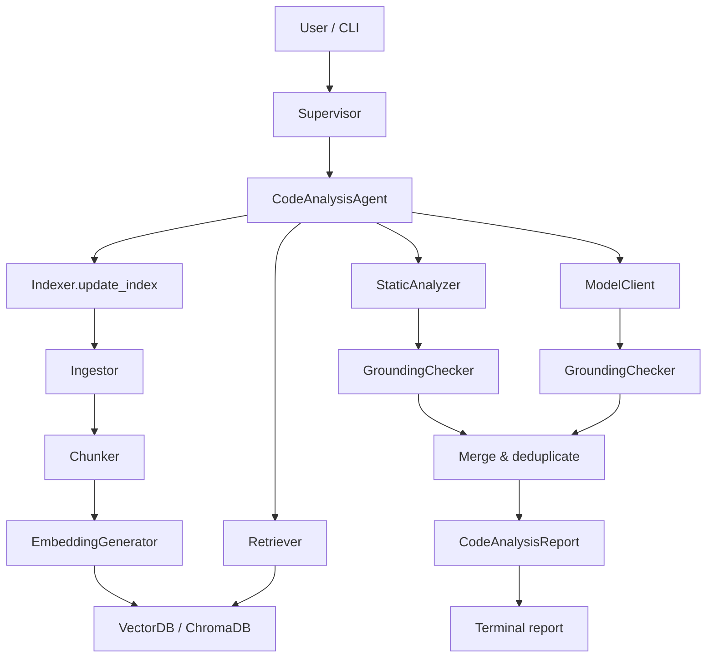

# Codebase Assistant

A multi-agent assistant that ingests a Python repository and helps a
developer understand, debug, test, and document it through structured
analysis and natural-language queries.

> **Status: Week 6 complete.** The foundation layer, tool layer, RAG
> pipeline, static analysis, grounding check, and Code Analysis Agent are
> implemented. LLM providers, the Documentation Agent, the Testing
> Agent, and MCP integration remain placeholders.

## Project Overview

Developers frequently inherit codebases they do not fully understand.
Finding bugs, tracing logic, and assessing code quality are slow and
manual tasks.

**Codebase Assistant** targets that problem with a supervisor/worker
architecture:

- **Code Analysis Agent** (implemented) — runs deterministic static
  analysis, optionally augments it with retrieved context and an LLM,
  and returns only **grounded** `BugReport` objects whose evidence has
  been verified against the real source.
- **Documentation Agent** (placeholder) — intended to generate docstrings
  and README sections.
- **Testing Agent** (placeholder) — intended to generate and execute
  pytest tests.

**Current scope:** Python source files (`.py`), Markdown (`.md`), and
plain text (`.txt`) for indexing. Up to 100 files, 20,000 lines, and
500 KB per file. Binary files, notebooks, and configured ignore
directories (`.git`, `__pycache__`, `venv`, `node_modules`) are skipped.

## Architecture

The system is organized in layers:

| Layer | Components | Status |
|---|---|---|
| Entry | `app/main.py`, `Project.ipynb` | CLI demo implemented; notebook still scaffold |
| Orchestration | `Supervisor` | Wires agents and shared services |
| Agents | `CodeAnalysisAgent`, `DocumentationAgent`, `TestingAgent` | Analysis agent implemented |
| Analysis | `StaticAnalyzer`, `GroundingChecker` | Implemented |
| RAG | `Chunker`, `EmbeddingGenerator`, `VectorDB`, `Ingestor`, `Indexer`, `Retriever` | Implemented |
| Tools | `FilesystemTools`, `GitHubTools`, `ToolRegistry` | Implemented (GitHub API methods except clone/validate are placeholders) |
| Models | `ModelClient`, `BaseProvider` | Client implemented; OpenRouter/Ollama providers are placeholders |
| Schemas | `BugReport`, `CodeAnalysisReport`, … | Implemented |

Shared services (`Config`, memory, tracing, hooks, plugins, skills) are
scaffolded for later weeks.

## Pipeline Diagram

### Code analysis pipeline (Week 6)



When no LLM provider is configured, the agent runs **static analysis
only** and skips indexing/retrieval (nothing consumes retrieved
context without a model).

### Grounding rule

Every finding must quote exact source text at a real line range. The
`GroundingChecker` reads the file and rejects any report whose evidence
does not match. Hallucinated LLM findings are logged and excluded, not
downgraded.

## Current Week 6 Capabilities

### Configuration (`config.py`)

Centralized settings for ingestion limits, ChromaDB paths, embedding
model, retrieval `top_k`, model identifiers, and logging. Environment
variables override defaults via `Config.load()`.

### Tools

- **`FilesystemTools`** — sandboxed read/write/list/search with workspace
  validation and size limits.
- **`GitHubTools`** — `validate_repository()` and `clone_repository()`
  (HTTPS GitHub URLs and local paths; GitPython with `git` CLI fallback).
- **`ToolRegistry`** — register, lookup, and execute tools with structured
  error results.

### RAG pipeline

- **`Chunker`** — AST-aware chunking for Python (one chunk per
  function/class); section chunking for Markdown and plain text.
- **`EmbeddingGenerator`** — `sentence-transformers` (`all-mpnet-base-v2`
  by default), lazy-loaded and cached.
- **`VectorDB`** — persistent ChromaDB storage with similarity search
  and metadata filtering.
- **`Ingestor`** — traverses a repository, respects limits, chunks,
  embeds, and stores.
- **`Indexer`** — incremental indexing via content-hash manifest.
- **`Retriever`** — semantic search returning `RetrievedChunk` objects.

### Static analysis

- **`StaticAnalyzer`** — `pyflakes` + `ast` detection of:
  - syntax errors
  - undefined variables
  - unused imports
  - unreachable code
  - duplicate definitions
  - wrong argument counts (conservative, intra-module)
  - mutable default arguments
  - bare `except:` clauses

### Grounding

- **`GroundingChecker`** — byte-for-byte evidence verification, stale-file
  detection, batch verification, optional ANSI-safe formatting helpers in
  the CLI layer.

### Code Analysis Agent

- **`analyze_repository()`** — full pipeline: index (when a model is
  available), static analysis, grounding, retrieval, optional LLM pass,
  merge, deduplicate, sort by severity.
- **`analyze_query()`** — natural-language questions over retrieved
  context.
- **`analyze_file()`** — deterministic single-file analysis.

Without a configured provider, the agent completes successfully with
static findings only.

### CLI demo

- **`app/main.py`** — accepts a repository path (argument or prompt),
  validates it, runs the agent, prints a formatted report.
- **`app/report_formatter.py`** — severity grouping, wrapped evidence,
  summary table, optional color (`--color` / `--no-color`).

### Tests

- **`tests/test_week6_integration.py`** — end-to-end pipeline test on a
  temporary buggy repository (no LLM required).

## Requirements

- Python 3.11+ (developed on 3.13)
- Dependencies in [`codebase_assistant/requirements.txt`](codebase_assistant/requirements.txt):

| Package | Purpose |
|---|---|
| `pydantic` | Structured schemas |
| `python-dotenv` | Environment loading (listed; wiring optional) |
| `GitPython` | Repository cloning |
| `chromadb` | Vector store |
| `sentence-transformers` | Embeddings |
| `pyflakes` | Static analysis |
| `requests` | Planned for OpenRouter (Week 7) |
| `jupyter` | Notebook interface |
| `pytest`, `pytest-cov` | Testing |

First run downloads the embedding model (~400 MB) when indexing is
triggered.

## Installation

From the `Project/` directory:

```bash
pip install -r codebase_assistant/requirements.txt
```

Optional environment variables (see `config.py`):

```bash
export OPENROUTER_API_KEY=...          # when a provider is implemented
export CHROMA_PERSIST_DIR=./.codebase_assistant/chroma
export MEMORY_STORE_PATH=./.codebase_assistant/memory_store
```

Runtime data under `.codebase_assistant/` is gitignored.

## Running the Demo

All commands assume your current directory is `Project/`.

**Analyze a repository:**

```bash
python app/main.py /path/to/repository
```

**Analyze the current project:**

```bash
python app/main.py codebase_assistant
```

**Ask a specific question:**

```bash
python app/main.py . --question "Find security bugs"
```

**Disable color output:**

```bash
python app/main.py codebase_assistant --no-color
```

**Run the integration test:**

```bash
PYTHONPATH=. python -m pytest codebase_assistant/tests/test_week6_integration.py -v
```

**Run the scaffold notebook** (still uses placeholder supervisor flow):

```bash
jupyter notebook Project.ipynb
```

## Example Output

```
Analyzing .../codebase_assistant ...
=================================================================
Code Analysis Report
=================================================================

Repository              .../codebase_assistant
Duration                0.44s
Static findings         1
LLM findings            0
Rejected hallucinations 0

Notes:
  - No model provider is available; ran deterministic analysis only.

Findings
-----------------------------------------------------------------

LOW  (1 finding)
-----------------------------------------------------------------
  [1] unused_import  models/providers/base.py:16  static  conf=0.95

  File:        models/providers/base.py
  Lines:       16
  Type:        unused_import
  Method:      static
  Confidence:  0.95
  Function:    <module>
  Description:
    'typing.Optional' imported but unused
  Evidence:
    | from typing import List, Optional

=================================================================
Summary Statistics
=================================================================

Metric                      Value
----------------------------------------
Total verified findings     1
  static                    1
  llm                       0
Files analyzed              65
Severity: low               1
Type: unused_import         1
```

## Current Limitations

These are intentional Week 6 boundaries or not-yet-implemented pieces:

- **No live LLM provider** — `OpenRouterProvider` and `OllamaProvider`
  are placeholders; analysis is static-only until Week 7.
- **Documentation and Testing agents** — scaffold only.
- **GitHub API** — only clone/validate work; PR/issue/branch methods are
  stubs.
- **MCP integration** — scaffold only.
- **Memory persistence** — `MemoryStore` is a placeholder.
- **`ReportBuilder`** — not wired into the agent output path yet.
- **Tracing** — scaffold only.
- **Docker** — `Dockerfile` / `docker-compose.yml` exist but are not
  end-to-end runnable.
- **`Project.ipynb`** — still demonstrates the old scaffold flow, not the
  Week 6 CLI pipeline.
- **Python-only bug detection** — static analysis targets `.py` files.
- **Indexing cost** — first index downloads embeddings model and writes
  to ChromaDB; skipped when no model is available.

## Week 7 Roadmap

Based on the proposal and remaining placeholders:

1. **Implement `OpenRouterProvider`** — real Claude calls for code
   analysis and grounded LLM findings.
2. **Implement `OllamaProvider`** — local Llama 3 for documentation
   generation.
3. **Wire providers into `Supervisor`** — inject configured providers
   into `ModelClient` and share `Indexer`/`Retriever` with agents.
4. **Implement Documentation Agent** — generate `DocumentationResult`
   objects from retrieved context.
5. **Implement Testing Agent** — generate and execute pytest tests,
   return `TestGenerationResult`.
6. **Update `Project.ipynb`** — ingest → analyze → document → test flow.
7. **Implement `ReportBuilder`** — assemble final user-facing reports
   from verified findings.
8. **GitHub API methods** — file retrieval, PR/issue listing (if needed
   for MVP).
9. **Tracing layer** — observability for pipeline stages.
10. **Docker end-to-end** — runnable Jupyter + Ollama stack.

## Folder Structure

```
Project/
├── app/
│   ├── main.py                 # CLI demo entry point
│   └── report_formatter.py     # Terminal report formatting
├── Project.ipynb               # Notebook (scaffold demo)
├── docs/
│   ├── architecture.excalidraw
│   └── architecture.png
└── codebase_assistant/
    ├── config.py
    ├── supervisor.py
    ├── agents/
    ├── analysis/               # StaticAnalyzer, GroundingChecker
    ├── rag/                    # Full indexing/retrieval pipeline
    ├── tools/
    ├── models/
    ├── schemas/
    ├── memory/                 # Placeholder persistence
    ├── tests/
    │   └── test_week6_integration.py
    └── requirements.txt
```

## Design References

- Editable architecture diagram:
  [`docs/architecture.excalidraw`](docs/architecture.excalidraw)
- Rendered preview:
  [`docs/architecture.png`](docs/architecture.png)
